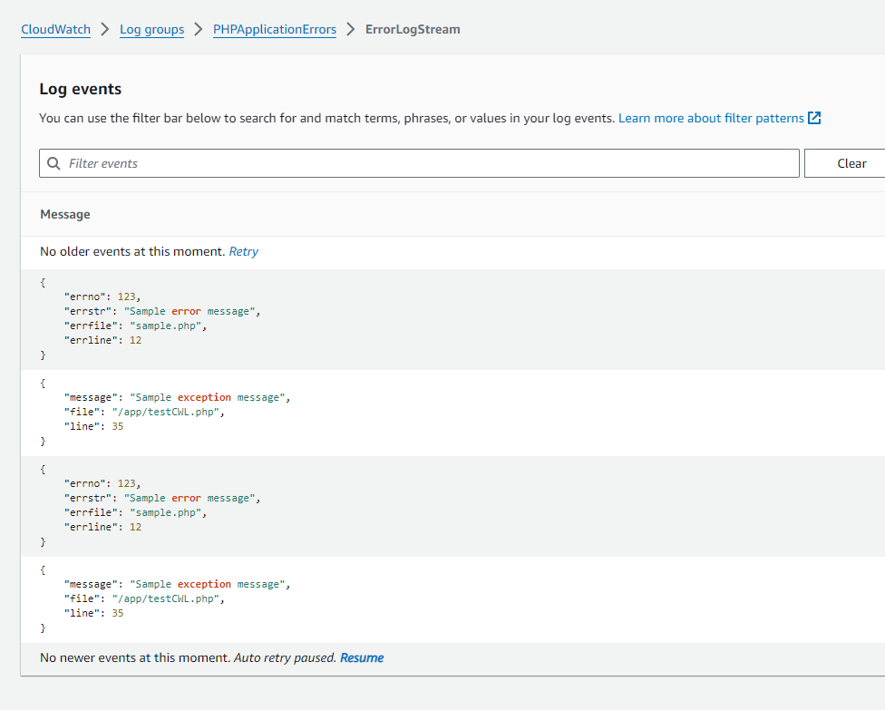
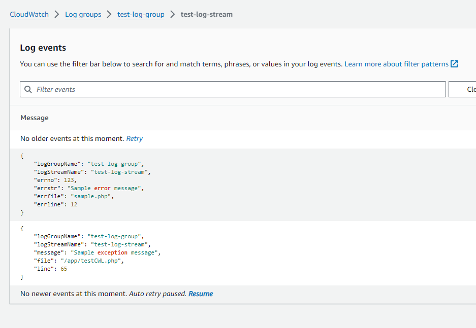

# Custom CloudWatch Logger

- [Custom CloudWatch Logger](#custom-cloudwatch-logger)
  - [What is it for:](#what-is-it-for)
  - [Tested environment](#tested-environment)
  - [Composer install](#composer-install)
  - [Notes](#notes)
  - [How to create custom log group name and log stream name](#how-to-create-custom-log-group-name-and-log-stream-name)
  - [Known(?) issue(s)](#known-issues)
  - [Example - Default](#example---default)
    - [Use default `logGroupName` and `logStreamName`](#use-default-loggroupname-and-logstreamname)
  - [Example - Custom `logGroupName` and `logStreamName`](#example---custom-loggroupname-and-logstreamname)
    - [Use custom `logGroupName` and `logStreamName`](#use-custom-loggroupname-and-logstreamname)
  - [Special thanks](#special-thanks)
    - [The AI Prompt I use](#the-ai-prompt-i-use)
      - [First prompt](#first-prompt)
      - [Second prompt](#second-prompt)

## What is it for:
This package is to solve a single problem: to write error log (both in string, array and Exception) format to AWS Cloudwatch.

The variables will be `json_encode()` into string value and put it to Cloudwatch.

## Tested environment
- I am testing it using Docker PHP 8.2.

## Composer install

`composer require elleryleung/custom-cloudwatch-logger:dev-main`

## Notes
- I haven't put it on composer [Packagist](https://packagist.org/), you would not find it there.
  - Updated:  I put it on Packagist
- Make sure you have necessary permission to create loggroup and logstream.
- If the code cannot create either loggroup or logstream, a tradition `error_log` function is used to log this event
- By default the log group name is `PHPApplicationErrors` and log stream name in the log group is `ErrorLogStream`.
- If you read the source code `CloudWatchErrorLogger.php`, you will see that I put the whole `$awsConfig` inside the constructor.
  - Which means, if you want to add other configuration, add it in `$awsConfig`

## How to create custom log group name and log stream name

Here you are:

```php
$my_settigs = [
    'logGroupName' => 'test-log-group',
    'logStreamName' => 'test-log-stream',
];
$cloudWatchErrorLogger = new CloudWatchErrorLogger($awsConfig, $my_settigs);
```

`$my_settigs` is an associative array.  At present the code only check below two array keys (The name implies itself, I would not explain it):
- `logGroupName`
- `logStreamName`

## Known(?) issue(s)

- I haven't tested using AWS cert or other crediential setting.  I love to use `key` and `secret` because it is simple and work.

## Example - Default
```php
<?php
// Assume this is the test PHP code in your test project that uses the CustomCloudWatchLogger package

// Require the Composer autoloader to autoload the CustomCloudWatchLogger package and its dependencies
require 'vendor/autoload.php';

// Import the CloudWatchErrorLogger class from the CustomCloudWatchLogger package
use Elleryleung\CustomCloudwatchLogger\CloudWatchErrorLogger;

// Create AWS config for the CloudWatchErrorLogger
$awsConfig = [
    'region' => 'ap-east-1',
    'version' => 'latest',
    'credentials' => [
        'key' => 'your_aws_key',
        'secret' => 'your_aws_secret',
    ],
];

// Create an instance of the CloudWatchErrorLogger
$cloudWatchErrorLogger = new CloudWatchErrorLogger($awsConfig);

// Log a sample error to CloudWatch
$errorData = [
    'errno' => 123,
    'errstr' => 'Sample error message',
    'errfile' => 'sample.php',
    'errline' => 12,
];
$cloudWatchErrorLogger->logErrorToCloudWatch($errorData);

// Log a sample exception to CloudWatch
try {
    // This could be any code that may throw an exception
    throw new Exception('Sample exception message');
} catch (Exception $e) {
    $exceptionData = [
        'message' => $e->getMessage(),
        'file' => $e->getFile(),
        'line' => $e->getLine(),
    ];
    $cloudWatchErrorLogger->logErrorToCloudWatch($exceptionData);
}
```

### Use default `logGroupName` and `logStreamName`


## Example - Custom `logGroupName` and `logStreamName`
```php
$custom = [
    'logGroupName' => 'test-log-group',
    'logStreamName' => 'test-log-stream',
];
$cloudWatchErrorLogger = new CloudWatchErrorLogger($awsConfig, $custom);

// Log a sample error to CloudWatch
$errorData = [
    'logGroupName' => $custom['logGroupName'],
    'logStreamName' => $custom['logStreamName'],
    'errno' => 123,
    'errstr' => 'Sample error message',
    'errfile' => 'sample.php',
    'errline' => 12,
];
$cloudWatchErrorLogger->logErrorToCloudWatch($errorData);

// Log a sample exception to CloudWatch
try {
    // This could be any code that may throw an exception
    throw new Exception('Sample exception message');
} catch (Exception $e) {
    $exceptionData = [
        'logGroupName' => $custom['logGroupName'],
        'logStreamName' => $custom['logStreamName'],
        'message' => $e->getMessage(),
        'file' => $e->getFile(),
        'line' => $e->getLine(),
    ];
    $cloudWatchErrorLogger->logErrorToCloudWatch($exceptionData);
}
```

### Use custom `logGroupName` and `logStreamName`


## Special thanks
- `Codeium`: 80% or more of the code is generated by AI (Codeium) in VSCode.  20% of the code is added by me.

### The AI Prompt I use

- In case you are interetsed in what prompt I am using.  Here you are
- This is not the **perfect** prompt.  There is no such thing as **perfect prompt**, which means if you found that it can be improved, yes you are right.

#### First prompt
Role: you are an experience PHP developer.  You develop PHP application with efficient and clean code and produce result.
Task: create a class that log all PHP error to AWS Cloudwatch Log when user calls `error_log()` function.
Context: There is a need to create a standalone function that, when user uses your application and, when they need to log their message, like `error_log(<string>)`,  `error_log(<array>)`, `error_log(<object>)`, user can view the exact logged content in AWS Cloudwatchlog easily.  You can reference to the following URL to get start:
- https://www.php.net/manual/en/function.set-error-handler.php
- https://docs.aws.amazon.com/aws-sdk-php/v2/guide/service-cloudwatchlogs.html
- https://docs.aws.amazon.com/aws-sdk-php/v2/guide/configuration.html
You should not limit yourself to just use the information mentioned, but you also use your knowledge and intelligent to complete this task.  You produce code that simply just work.  And if you cannot produce result in a single session, you can split it into multiple session.  Never make up code or function that does not exists.  If you need further information, you ask the user instead of creating yourself.  Please let me know if you understand the task or not.

#### Second prompt
Role: you are an experience PHP developer who are also an expert in AWS services.  You develop PHP application with efficient and clean code and produce result.
Task: Update the `CloudWatchErrorLogger.php` file and add checking that if loggroup and logstream does not exist, create them.
Context: We use `CloudWatchErrorLogger.php` to log errors to CloudWatch, yet we need to check if loggroup and logstream exists or not.  If not, create them.
You can reference to the following URL to get start:
- https://www.php.net/manual/en/function.set-error-handler.php
- https://docs.aws.amazon.com/aws-sdk-php/v2/guide/service-cloudwatchlogs.html
- https://docs.aws.amazon.com/aws-sdk-php/v2/guide/configuration.html
You should not limit yourself to just use the information mentioned, but you also use your knowledge and intelligent to complete this task.  You produce code that simply just work.  And if you cannot produce result in a single session, you can split it into multiple session.  Never make up code or function that does not exists.  If you need further information, you ask the user instead of creating yourself.  Please let me know if you understand the task or not.

Here is the `CloudWatchErrorLogger.php` file:
```
... the code .....
```